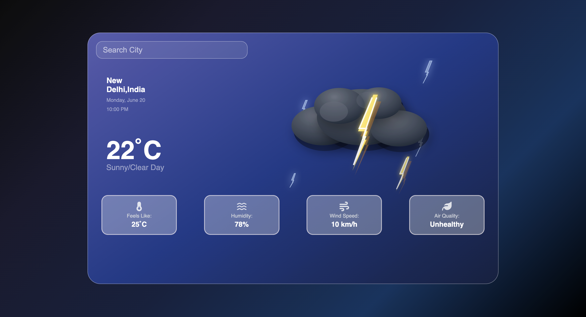

# Weather Application 🌤️

A simple and interactive **Weather Application** built with JavaScript, HTML, and CSS. This app allows users to get real-time weather information for any city in the world.

---

## Features ✨
- Search weather by **city name** 🌆
- Display **temperature, humidity, wind speed, feels like, and air quality**
- Interactive **weather cards** with hover effects
- Responsive and **mobile-friendly design**
- Real-time data from **OpenWeatherMap API** or similar

---

## Demo 🚀
You can check a live demo here:  
[Your Live Demo Link]  

---

## Screenshots 📸



---

## Installation 💻
1. Clone the repository:
```bash
git clone https://github.com/yourusername/Weather_Application.git
